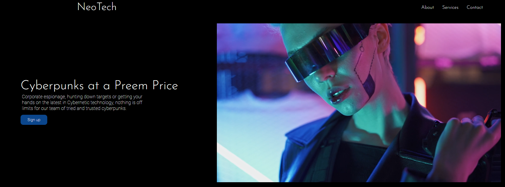

# NeoTech Landing Page

A landing page I made for a fictional Cyberpunk company called NeoTech. The idea was inspired by Cyberpunk 2077 and was created as part of The Odin Project.

# Language

- HTML
- CSS

# Credits

- Photo by Mikhail Nilov: https://www.pexels.com/photo/woman-in-black-leather-jacket-wearing-a-helmet-8107979/
- Photo by Mikhail Nilov: https://www.pexels.com/photo/woman-in-black-leather-jacket-holding-a-gun-8107904/ 
- Photo by Mikhail Nilov: https://www.pexels.com/photo/man-in-black-leather-jacket-and-pants-8108383/
- Photo by Alena Darmel: https://www.pexels.com/photo/woman-illuminated-by-neon-lights-posing-at-the-camera-6940417/
- Video by Mikhail Nilov: https://www.pexels.com/video/a-stylist-woman-posing-with-neon-light-background-8058474/

# Image

